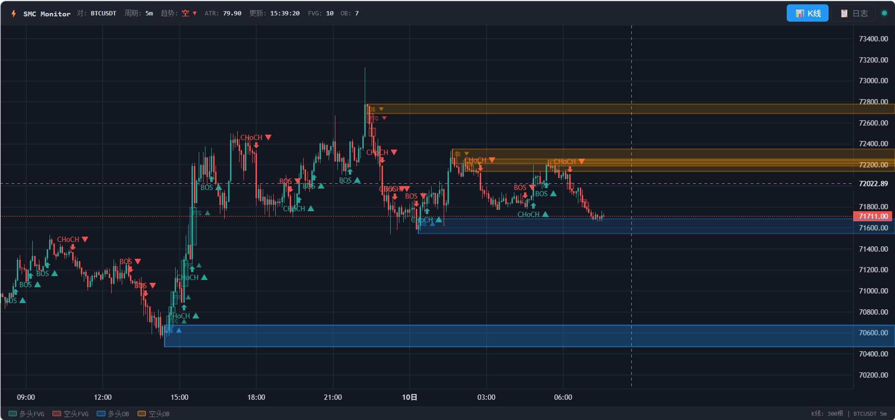
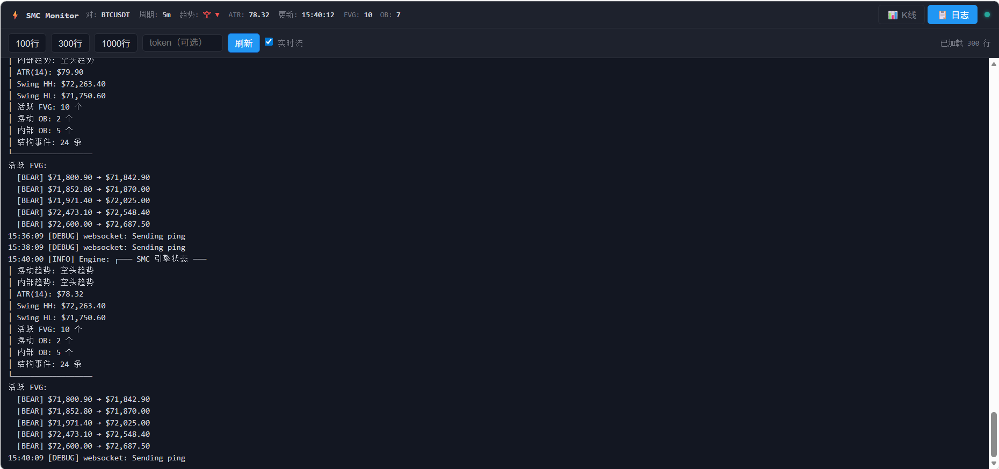

基于 Binance Futures WebSocket 实时数据 + 可热拔插策略的量化交易系统。

## 更新日志

### v1.0.5 (2026-04-10)
- **修复**：`engine/smc.py` 结构分析（candle 追加、ATR、pivot 更新、BOS/CHoCH 检测、FVG 创建）改为**仅在收盘 K 线执行**，消除 WebSocket intrabar tick 产生的虚假结构信号；FVG 缓解、OB 缓解、追踪极值、交易信号每个 tick 仍实时检测
- **修复**：`engine/smc.py` `_display_structure()` 中看涨/看跌扫描各自使用对应 pivot 的 `bar_index` 作为起点（原来统一用 `high_pivot.bar_index` 导致看跌信号 scan 窗口偏早，产生非对称过度检测）
- **修复**：`engine/smc.py` `_delete_order_blocks()` 改为接受实时 candle 参数，每 tick 使用当前价格缓解 OB，而非等待 K 线收盘
- **新增**：`engine/smc.py` 将 `_update_fvgs()` 拆分为 `_create_fvgs()`（仅收盘）和 `_mitigate_fvgs(candle)`（每 tick），保留 `_update_fvgs()` 作为兼容别名
- **修复**：`main.py` 补充缺失的 `import time`，导致 `_dump_chart_state()` 中 `time.time()` 抛 `NameError` 被静默吞掉，`logs/chart_state.json` 始终无法写入
- **修复**：`main.py` 中 `_dump_chart_state()` 按 `open_time` 去重后再取最近 300 根，避免同一根 K 线的多个 tick 快照被视为多根 K 线导致图表 K 线全部叠在一点
- **新增**：`log_web.py` 集成 TradingView Lightweight Charts，K 线图表支持 FVG 矩形（多/空）、订单块（OB 多/空）、BOS/CHoCH 箭头标记实时渲染
- **新增**：`main.py` 新增 `_dump_chart_state()` 函数，将 SMC 引擎当前状态（K 线、FVG、OB、结构事件、趋势、ATR）原子写入 `logs/chart_state.json`，每 5 tick 或收盘时更新
- **新增**：`log_web.py` 新增 `/api/chart` 端点，供前端每 2 秒轮询图表数据；网页从纯文本日志切换为双 Tab（K 线图 + 日志）布局
- **新增**：图表页面顶部实时显示交易对、周期、趋势方向、ATR、FVG/OB 数量、最后更新时间




### v1.0.4 (2026-04-09)
- **修改**：`engine/smc.py` R:R 过滤改为分级逻辑：`R:R < 1.0` 强制丢弃（任何环境）；`R:R 1.0~1.5` 仅当 MTF 高级别趋势明确对齐时允许开仓；`R:R >= 1.5` 正常开仓
- **修改**：`engine/smc.py` 模式 A 70% 限价单入场位由 FVG 中点改为**FVG 远端内侧（中点 ± 20% × 高度）**，看涨 `limit = fvg_mid - 0.20 × fvg_size`，看跌 `limit = fvg_mid + 0.20 × fvg_size`
- **新增**：模式 A 限价单取消逻辑（以下任一触发即撤单）：① 价格实体收盘离开 FVG 区间；② FVG 达到 `FVG_MAX_AGE` 过期；③ 同向 BOS/CHoCH 已确认（趋势开启，无需继续等待回踩）
- **修改**：`engine/smc.py` 模式 A 看涨触发条件简化，仅保留 `fvg_mid < close <= fvg.top`，移除宽松插针条件
- **同步**：`strategy/Strategy.md` 与上述逻辑保持一致

### v1.0.3 (2026-04-09)
- **新增**：`exchange/dry_run_trader.py`，实现接近实盘的 Dry-Run 模拟交易模式，复用实盘下单/风控流程（含熔断、FVG 分拆建仓、钉钉推送），但不发真实委托
- **新增**：Dry-Run 支持使用配置中的 `capital` 作为虚拟资金，启动日志与状态摘要中可直接看到虚拟余额/盈亏信息
- **修改**：`main.py` 增加运行模式互斥校验（`--backtest` / `--live` / `--dry-run` 只能启用一个），避免模式冲突导致日志与行为混杂
- **修改**：`main.py` 在每根收盘 K 线向交易模块传递 high/low/close，用于 Dry-Run 更准确地模拟止盈止损触发
- **修改**：`exchange/trader.py` 的 `check_position_status()` 签名兼容 Dry-Run 接口参数，统一实盘与模拟模式调用方式
- **修复**：`smctrade.service` 移除强制 `-l` 启动参数，改为由配置文件中的 `live/backtest/dry_run` 决定模式，修复日志文件名和模式标识显示错误（如误显示 `live`）

### v1.0.2 (2026-04-07)
- **新增**：`exchange/binance.py` 新增 `fetch_klines_since()` 方法，支持从指定时间戳向后拉取已收盘 K 线，用于断线重连后补拉缺口
- **新增**：`exchange/kline.py` 新增 `fill_gap()` 方法，记录最后已收盘 K 线时间戳，重连时自动补拉丢失 K 线并送入策略引擎，保持结构状态连续
- **新增**：`main.py` 新增 WebSocket 连接计数 `_ws_connect_count`，断线重连时自动触发 `fill_gap()`
- **修改**：默认策略由 `smc` 改为 `smc-enhanced`，历史回测与实盘保持一致
- **修改**：默认历史 K 线缓存数量 `--buffer` 从 200 增大至 300，提升策略初始化精度

## 核心亮点

### 策略热拔插架构
- **零侵入扩展**：在 `strategy/` 目录下编写新策略，无需修改核心代码
- **统一回测框架**：所有策略共享同一套回测引擎，快速验证策略效果
- **多策略并行**：同一项目下可同时开发和测试多个策略
- **即插即用**：通过 CLI 参数 `-s` 瞬间切换不同策略进行回测或实盘

### 技术特性
- 实时 WebSocket 数据流 + 历史数据回测
- 完整的订单管理（开仓、止损、止盈、持仓管理）
- 支持全仓/逐仓模式，灵活的仓位控制
- 详细的日志记录和交易数据导出

## 合约交易默认规则
```
仓位模型（全仓模式）：
  仓位大小 = 币种数量 × 入场价
  全仓：整个账户余额作为保证金池（非逐仓，不易爆仓）
  爆仓价:
    做多: 入场价 × (1 + 维持保证金率) - 有效余额 / 币种数量
    做空: 入场价 × (1 - 维持保证金率) + 有效余额 / 币种数量
    其中 有效余额 = 账户余额 - 入场手续费

开仓数量优先级（回测 & 实盘通用）：
  --qty（固定币种数量）> --position-size（固定 USDT 仓位）> --risk（风险公式）

熔断机制：
  - 单日亏损 ≥ 账户余额 n% → 当日不再开仓（次日 UTC 自动重置）
  - 连续亏损 n 笔 → 冻结 n 根 K 线不交易
  - 盈利后连续亏损计数器归零

手续费模型(Binance Futures):----->此处根据你个人账户vip等级调整
  - 吃单方 (taker): 0.05%（市价单、止损单、止盈单）
  - 挂单方 (maker): 0.02%
  - 回测默认使用 taker 费率，入场+出场各扣一次，计入净盈亏
```

## 项目结构

```
binance-websocket/
├── main.py                 # 入口 + CLI 参数 + 策略注册表
├── config.py               # 常量、端点、默认参数
├── models.py               # 数据结构（Candle, Pivot, OrderBlock, FVG...）
├── requirements.txt        # 依赖
├── README.md
├── strategy/               # 策略层（可插拔）
│   ├── __init__.py          # 注册表 + 工厂函数
│   ├── base.py              # BaseStrategy 抽象基类
│   ├── smc.py               # SMC 策略包装
│   └── smc_enhanced.py      # 增强型 SMC 策略
├── engine/                 # 算法实现层
│   ├── __init__.py
│   ├── smc.py              # SMC 核心引擎（摆点/BOS/FVG/OB/ATR）
│   ├── smc_enhanced.py     # 增强型 SMC 引擎
│   └── detectors.py        # 摆点检测（Pine leg() 移植）
├── exchange/               # 交易所连接层 (Futures Only)
│   ├── __init__.py
│   ├── binance.py           # REST 历史 + WebSocket 实时
│   ├── kline.py             # KlineManager 数据管道（注入策略）
│   └── trader.py            # 实盘交易 (API签名/下单/止损止盈/持仓管理)
├── backtest/               # 回测模块
│   ├── __init__.py
│   └── backtest.py          # BacktestEngine（注入策略）+ 绩效统计 + CSV 导出
├── historical_data/         # 本地历史数据（CSV格式）
├── logs/                    # 日志文件
├── fetch_historical_data.py  # 批量历史数据获取脚本
└── fetch_single_interval.py  # 单周期历史数据获取脚本
```


## 策略热拔插架构

项目采用可插拔架构，新增策略只需三步：

```python
# 1. strategy/my_strategy.py
from strategy.base import BaseStrategy
from models import Candle, TradeSignal

class MyStrategy(BaseStrategy):
    def update(self, candle: Candle):
        # 你的策略逻辑
        return None  # 或 TradeSignal(...)

    def summary(self):
        return "MyStrategy OK"

# 2. strategy/__init__.py 中注册
STRATEGIES = {
    "smc": SMCStrategy,
    "smc-enhanced": EnhancedSMCStrategy,
    "my_strategy": MyStrategy,  # ← 添加
}

# 3. 使用
# python main.py BTCUSDT -s my_strategy -b
```

### 架构优势

- **解耦设计**：策略层与引擎层完全分离，策略开发不影响核心功能
- **快速迭代**：修改策略无需重启系统，代码变更即时生效
- **统一接口**：所有策略遵循相同的 BaseStrategy 接口，便于维护和测试
- **性能优化**：策略可独立优化，共享回测引擎的高效执行能力

## 快速开始

```bash
# 安装依赖
pip install -r requirements.txt

# ━━ 推荐：使用 JSON 配置文件启动 ━━
# 运行模式（backtest / dry_run / live）必须在 JSON 文件中指定，不能与 --config 同时在 CLI 传入 -b/-l/-d
# 原因：--config 会将 JSON 中的模式标志设为 argparse 默认值，
#       若再通过 CLI 传第二个模式标志，将触发"运行模式冲突"报错

# 1) 回测 —— 在 config.json 中设置 "backtest": true
python main.py --config config.json

# 2) Dry-Run 模拟交易 —— 在 config.json 中设置 "dry_run": true
python main.py --config config.json

# 3) 实盘 —— 在 config.json 中设置 "live": true，并填写 API Key/Secret
python main.py --config config.json

# ━━ 纯 CLI 启动（不使用配置文件时可携带模式标志） ━━
python main.py BTCUSDT                          # BTC 30m 行情监控
python main.py ETHUSDT -i 1h                    # ETH 1h 行情监控

python main.py BTCUSDT -b                       # 回测（默认 smc-enhanced）
python main.py BTCUSDT -b -s smc --debug        # 指定策略并启用 DEBUG

python main.py BTCUSDT --dry-run --capital 1000 # Dry-Run 模拟交易

# 启用 DEBUG 日志（输出结构突破、FVG检测等详细信息）
python main.py BTCUSDT -b --debug               # 回测并显示 DEBUG 信息

# 固定仓位回测
python main.py BTCUSDT -b --qty 0.01            # 每笔固定 0.01 BTC
python main.py BTCUSDT -b --position-size 5000  # 每笔固定 5000 USDT

# 回测结果导出 CSV
python main.py BTCUSDT -b --export-csv yourfilename.csv
python main.py BTCUSDT -b --qty 0.01 --export-csv yourfilename.csv

# ━━ 实盘（不使用配置文件） ━━
export BINANCE_API_KEY="your_key"
export BINANCE_API_SECRET="your_secret"
python main.py BTCUSDT --live                                   # 10x 实盘 (风险公式)
python main.py BTCUSDT -l --leverage 50                         # 50x 实盘
python main.py BTCUSDT -l --api-key xxx --api-secret yyy       # 使用其他账号时直接传参

# 固定仓位实盘
python main.py BTCUSDT -l --qty 0.01 --api-key xxx --api-secret yyy           # 固定 0.01 BTC
python main.py BTCUSDT -l --position-size 5000 --api-key xxx --api-secret yyy # 固定 5000 USDT
```

## 命令行参数

| 参数 | 默认值 | 说明 |
|------|--------|------|
| `symbol` | BTCUSDT | 交易对 |
| `-s`, `--strategy` | smc-enhanced | 策略名称（可用: smc, smc-enhanced） |
| `--config` | 无 | JSON 配置文件路径，CLI 参数优先于配置文件 |
| `--interval`, `-i` | 30m | K 线周期 |
| `--dry-run`, `-d` | 关 | Dry-Run 模拟交易模式，复用实盘下单/风控逻辑，但不真实下单 |
| `--sl` | 1.5 | 止损 ATR 倍数 |
| `--tp` | 3.0 | 止盈 ATR 倍数 |
| `--swing` | 50 | 摆动结构识别窗口 |
| `--buffer` | 300 | 历史 K 线数量 |
| `--leverage` | 10 | 杠杆倍数 |
| `--log-dir` | logs | 日志文件目录，空字符串关闭文件日志 |
| **仓位控制（回测 & 实盘通用）** | | |
| `--qty` | 0 | 固定每笔开仓数量 (币种)，如 0.1 BTC。优先级最高 |
| `--position-size` | 0 | 固定每笔仓位大小 (USDT)，如 5000。设此则忽略 `--risk` |
| `--risk` | 0.02 | 每笔风险比例（默认方式） |
| **回测** | | |
| `--backtest`, `-b` | 关 | 回测模式 |
| `--candles` | 1000 | 回测 K 线数量（使用本地 CSV 数据时，取最后 N 根） |
| `--capital` | 10000 | 初始资金 (USDT) |
| `--fee` | 0.0005 | 手续费率 (taker 0.05%) |
| `--export-csv` | 无 | 导出交易明细为 CSV 文件 |
| **实盘** | | |
| `--live`, `-l` | 关 | 实盘交易模式 |
| `--api-key` | 环境变量 | Binance API Key |
| `--api-secret` | 环境变量 | Binance API Secret |
| `--margin-type` | ISOLATED | 保证金模式 (ISOLATED/CROSSED) |
| `--debug` | 关 | 启用 DEBUG 日志级别，输出结构突破、FVG检测等详细信息 |

## CSV 导出格式

使用 `--export-csv` 导出交易明细，UTF-8 with BOM 编码：

| 开仓时间 | 出场时间 | 开仓方向 | 交易手数 | 入场价格 | 出场价格 | 出场原因 | 盈亏(USDT) | 账户余额 |
|----------|---------|---------|---------|---------|---------|---------|-----------|----------|
| 2026-03-15 08:30 | 2026-03-15 10:00 | 做多 | 0.0100 | 85230.00 | 85890.00 | 止盈 | +39.52 | 10039.52 |
| 2026-03-15 14:00 | 2026-03-15 16:30 | 做空 | 0.0100 | 85890.00 | 86500.00 | 止损 | -28.41 | 10011.11 |

出场原因包括：止盈、止损、爆仓强平、反向信号、数据结束

## 配置文件

在 config.json 中配置你的交易参数。

建议通过 `live / backtest / dry_run` 三个布尔字段显式指定运行模式：
- `backtest: true`：回测
- `dry_run: true`：模拟交易
- `live: true`：实盘

使用 `--config` 加载 JSON 配置文件，CLI 参数优先于配置文件：

```json
{
  "symbol": "BTCUSDT",
  "interval": "5m",
  "leverage": 50,
  "live": false,
  "backtest": false,
  "dry_run": true,
  "candles": 10000,
  "capital": 1000,
  "risk": 0.073,
  "fee": 0.0005,
  "position_size": 0,
  "qty": 0,
  "export_csv": "trades.csv",
  "strategy": "smc-enhanced",
  "debug": false
}
```

```bash
python main.py --config config.json                   # 按 JSON 中设定的模式运行
# ⚠️ 不要在使用 --config 时额外传 -b / -l / -d：
#   JSON 已将模式设为默认值，CLI 再传一个模式标志会触发"运行模式冲突"报错
# 如需临时覆盖非模式参数（如 leverage），直接追加即可：
python main.py --config config.json --leverage 100    # 覆盖杠杆，模式仍由 JSON 决定
```

## 历史数据管理

### 1. 获取历史数据

使用脚本获取从 2021-01-01 开始的历史数据：

```bash
# 批量获取所有周期数据
python fetch_historical_data.py

# 单周期获取（推荐，避免内存问题）
python fetch_single_interval.py --interval 5m
python fetch_single_interval.py --interval 15m
python fetch_single_interval.py --interval 30m
python fetch_single_interval.py --interval 1h
python fetch_single_interval.py --interval 2h
python fetch_single_interval.py --interval 4h
python fetch_single_interval.py --interval 12h
python fetch_single_interval.py --interval 1d
```

数据会保存到 `historical_data/` 目录，格式为 `{symbol}_{interval}_2021_01_01.csv`。

### 2. 使用本地数据回测

系统会自动检测本地数据文件，优先使用 CSV 数据进行回测：

```bash
# 会自动使用 historical_data/BTCUSDT_30m_2021_01_01.csv
python main.py BTCUSDT -b -i 30m --candles 10000
```

## 日志

每次运行自动在 `logs/` 目录生成日志文件，格式：`smc_{模式}_{交易对}_{时间戳}.log`

交易信号日志会包含 K 线时间信息：

```
=== 交易信号 === [K线时间: 2026-04-03 10:00]
  方向: 做多
  入场: $66,275.65 (FVG $66,123.45-$66,387.85)
  止损: $65,892.12 (结构止损)
  止盈: $68,032.57 (ATR × 3)
  盈亏比: 2.35 | ATR: $383.53
```

增强型策略日志：

```
=== 增强型交易信号 [质量: 75/100] [K线时间: 2026-04-03 10:00] ===
  方向: 做多
  市场环境: 强趋势
  理论入场: $66,275.65
  预期滑点: 0.05%
  实际入场: $66,308.89 (滑点调整后)
  止损: $65,892.12
  止盈: $68,032.57
  成交量比率: 1.2x
  高周期趋势: BULLISH
```

### DEBUG 日志

使用 `--debug` 参数启用 DEBUG 日志级别，可查看结构突破、FVG检测等详细过程：

```bash
python main.py BTCUSDT -b --debug
```

DEBUG 日志输出示例：

```
[DEBUG] [UP] Internal BOS 看涨 | 突破 $70,738.90 → 收盘 $70,773.00
[DEBUG] [DOWN] Internal CHoCH 看跌 | 跌破 $70,655.10 → 收盘 $70,487.50
[DEBUG] [BEAR] FVG 看跌 | $70,600.00 → $70,653.20 (gap=53.20)
[DEBUG] [BULL] FVG 看涨 | $70,662.60 → $70,681.10 (gap=18.50)
```

默认情况下（不启用 `--debug`），这些内部检测日志不会输出，只会显示交易信号和重要的系统信息。

```bash
python main.py BTCUSDT -b --log-dir /var/log/smc  # 自定义日志目录
python main.py BTCUSDT -b --log-dir ""             # 关闭文件日志
```

## 合法周期

`1m` `3m` `5m` `15m` `30m` `1h` `2h` `4h` `6h` `8h` `12h` `1d` `3d` `1w` `1M`

## Binance WebSocket 数据格式

所有价格和成交量字段为 **STRING** 类型，代码内部自动做 `float()` 转换。

K 线收盘标志 `k.x` 为 **BOOLEAN**：
- `false`：K 线进行中，每笔成交推送更新
- `true`：K 线已收盘，仅推送一次

## 网络要求

| 端点 | 用途 |
|------|------|
| `fapi.binance.com` | Futures REST API |
| `fstream.binance.com` | Futures WebSocket |

> ⚠️ 国内可能无法直连 Binance，需要配置代理。
